# Cloud Studios full-site audit

Audit date: 1 September 2026  
Environment: local React/Vite prototype at desktop 1487×1058 and mobile 390×844  
Scope: all 13 routes, primary conversion journeys, responsive behavior, accessibility basics, metadata, production build, Sites packaging, and current visual system

## Remediation update — completed 1 September 2026

All code and content findings that can be resolved inside this local prototype are complete.

| Original finding | Resolution |
| --- | --- |
| Mobile-menu dismissal and isolation | Added a visible close control, Escape dismissal, focus containment, body-scroll lock, inert background regions, `aria-hidden` restoration and focus return. |
| Generic conversion actions | Added service-specific hero actions for office viewings, desk tours, meeting-room availability, virtual-office enquiries, experiences and the office waitlist. Query parameters prefill the relevant form subject or service interest. |
| Form errors and mobile path | Added native required semantics, linked field errors, a live error summary with focus movement, focused success/reset states and moved the mobile form before the large reassurance card. The first mobile tour field now begins at 679 px rather than about 1,169 px. |
| Thin decision support | Added four verified at-a-glance facts and three contextual FAQs to every core service page, plus live price, capacity, equipment, terms, inclusion and availability context. |
| Photo trust | Added `asset-provenance.md` and made owner/on-site verification a release gate. The prototype does not claim that visual inspection proves photo authenticity. |
| Initial JavaScript payload | Three.js and GSAP now load as asynchronous chunks; mobile and reduced-motion users retain the static hero. The shared entry is 311.62 kB / 97.42 kB gzip, down from 945.05 kB / 274.32 kB gzip. The 734.52 kB Three.js chunk loads only when the desktop homepage scene mounts. |
| Policy completeness | Added dated, named-business, contact, prototype-form, booking and external-link disclosures grounded in the current live copy. Independent legal review remains a production release gate. |
| Small-text contrast | Darkened terracotta and added a dark gold text token. White/terracotta is 5.14:1 and gold-ink/cream is 5.23:1. |
| Contact and FAQ discoverability | Added Contact to the desktop navigation, retained the complete full-screen menu, and added contextual FAQ links on service pages. The header compacts safely before navigation overlaps. |
| Oversized transitions | Reduced service hero, editorial, pricing, form and policy spacing while preserving the selected cream editorial composition. |
| Community and Experiences specificity | Added only source-grounded use cases, working expectations and tailored next steps; no schedules, testimonials or capacities were invented. |
| Availability trust | Added a visible 1 September 2026 verification date and an office waitlist path. |
| SEO | Added unique route descriptions, Open Graph fields, canonicals, LocalBusiness geo data, Service schema and FAQPage schema. |
| Media loading | Kept hero media eager and made below-fold mosaic, service, gallery, location, contact and footer media lazy/async. |
| Obsolete assets | Moved 29 unused variants (3,700,112 bytes) out of `public/` into the recoverable `audit/asset-archive-2026-09-01/` folder. The public media directory now contains 18 referenced files and no unreferenced files. |
| Conversion instrumentation | Added privacy-safe local intent events for service/tour CTAs, form start, validation error, demo success, phone, email and map clicks. The prototype sends no analytics data; a production analytics provider can subscribe to `cloudstudios:intent`. |

Verification after remediation: `npm test` 5/5, `npm run build` passed, `npm run test:sites` 4/4, all 13 routes passed direct checks at desktop/tablet/mobile widths, both forms passed error/success checks, browser console errors/warnings: 0.

## Executive summary

Cloud Studios has a distinctive and coherent premium identity. The cream editorial system, large serif type, real prices, location details, and calm tone make the prototype feel more considered than a conventional coworking template. The route structure is complete and technically healthy.

The site is not production-ready yet. The most urgent defect is the mobile menu: its full-screen overlay hides the close control and cannot be dismissed with Escape. The next-largest opportunity is conversion design. Every service inherits “Book a tour,” even when the real intent is a meeting-room booking or virtual-office enquiry. Service pages look polished but do not yet answer enough practical questions to help a prospect decide.

### Health snapshot

| Area | Health | Summary |
| --- | --- | --- |
| Visual identity | Strong | Distinctive, calm, consistent editorial direction. |
| Information architecture | Good | Full route set and useful footer; primary navigation omits Contact and FAQ. |
| Service decision support | Needs work | Prices are visible, but inclusions, availability context, process and service-specific actions are thin. |
| Conversion | Needs work | Clear tour emphasis, but CTAs are too generic and the mobile form starts far below the fold. |
| Accessibility | At risk | Good foundations, but mobile-menu behavior and form error handling need correction; two color pairs fail AA for small text. |
| Responsive design | Mostly good | No horizontal overflow or broken media at tested widths; mobile hierarchy is clear. |
| SEO and trust | Good foundation | Route titles, descriptions, canonicals and LocalBusiness schema exist, but descriptions and policies are generic. |
| Performance | At risk | Production JavaScript is 945.05 kB minified / 274.32 kB gzip and is not route-split. |
| Technical health | Strong | App tests, production build and Sites worker tests pass; no browser console errors were observed. |

## Audited journeys

1. **Homepage discovery — good.** The proposition, tour action, service choices and Epsom location are immediately clear. Desktop is visually memorable; mobile retains the hierarchy without overflow. The proof strip is useful but its smallest labels are difficult to read.

   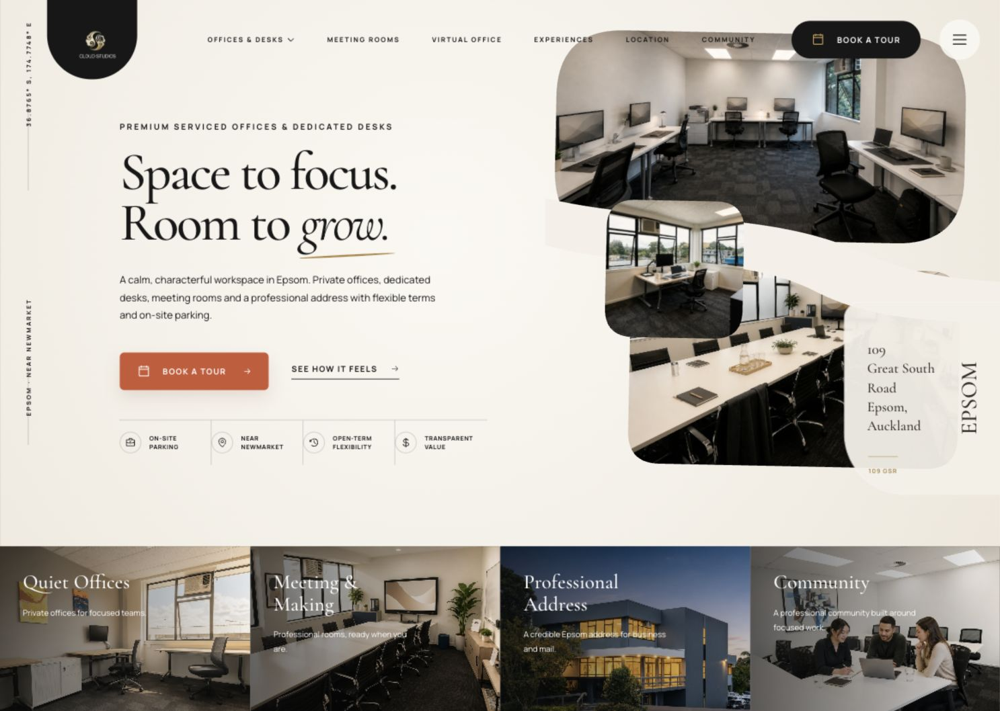

   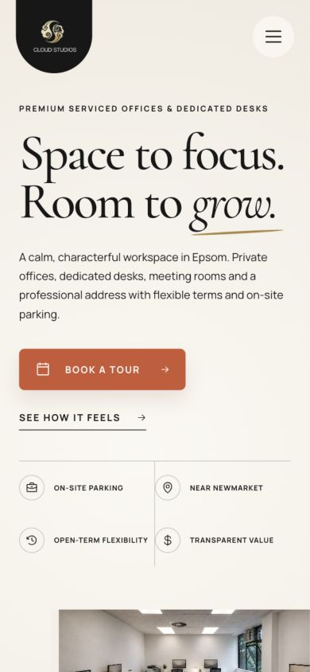

2. **Private Office Suites — good foundation.** Exact starting price and the tour CTA are prominent. The page needs clearer suite capacity, included services, availability recency and what happens after enquiry.

   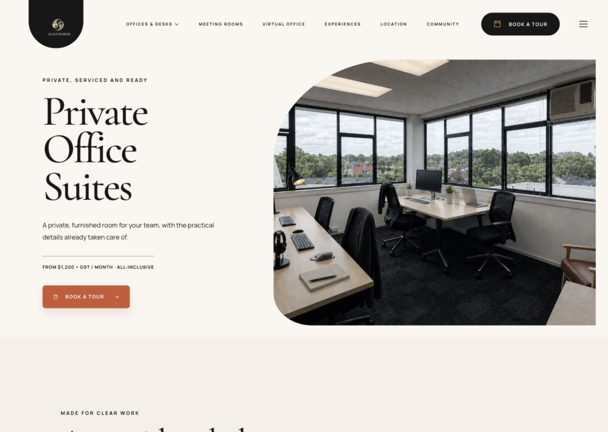

3. **Dedicated Desks — good foundation.** Part-time/full-time positioning and starting price are clear. The page does not explain access days, storage, desk setup, shared amenities or who each option suits until much later, if at all.

   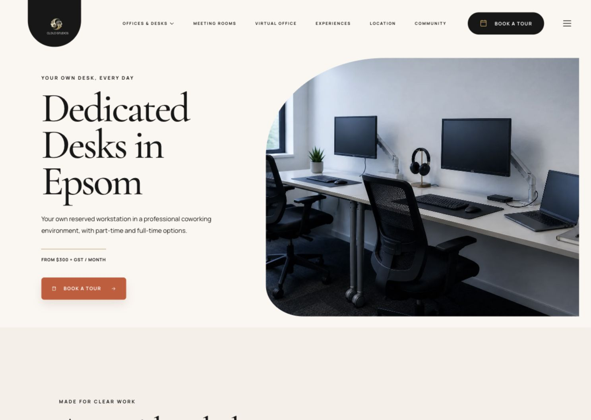

4. **Meeting Rooms — mixed.** Price and room setup are credible, but “Book a tour” is the wrong primary action for an hourly room-hire visitor. Capacity and display details exist later; availability, minimum booking, cancellation and a direct booking/enquiry path do not.

   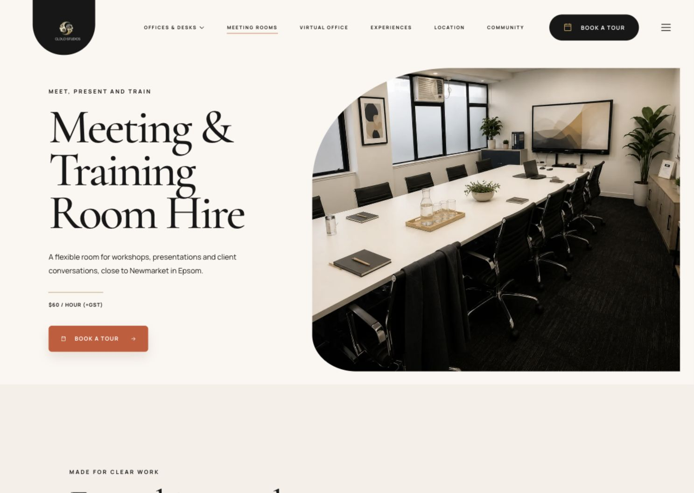

5. **Virtual Office — weak conversion fit.** The proposition is understandable, but the hero says “Enquire for current options” and then asks the visitor to book a tour. The later “Ask about virtual office” link is the correct intent but appears too late.

   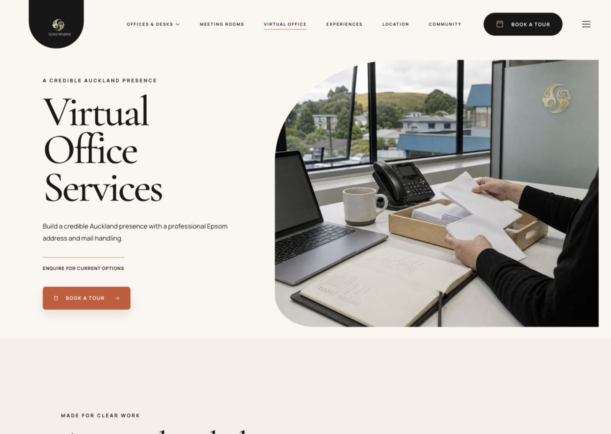

   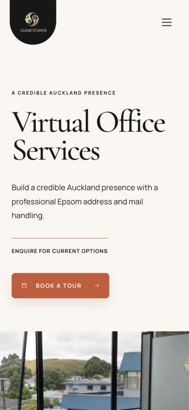

6. **Experiences and Community — visually good, informationally thin.** Both pages use strong imagery and the same editorial anatomy. Neither provides concrete examples, cadence, capacities, past events, member proof, participation expectations or a tailored next step.

   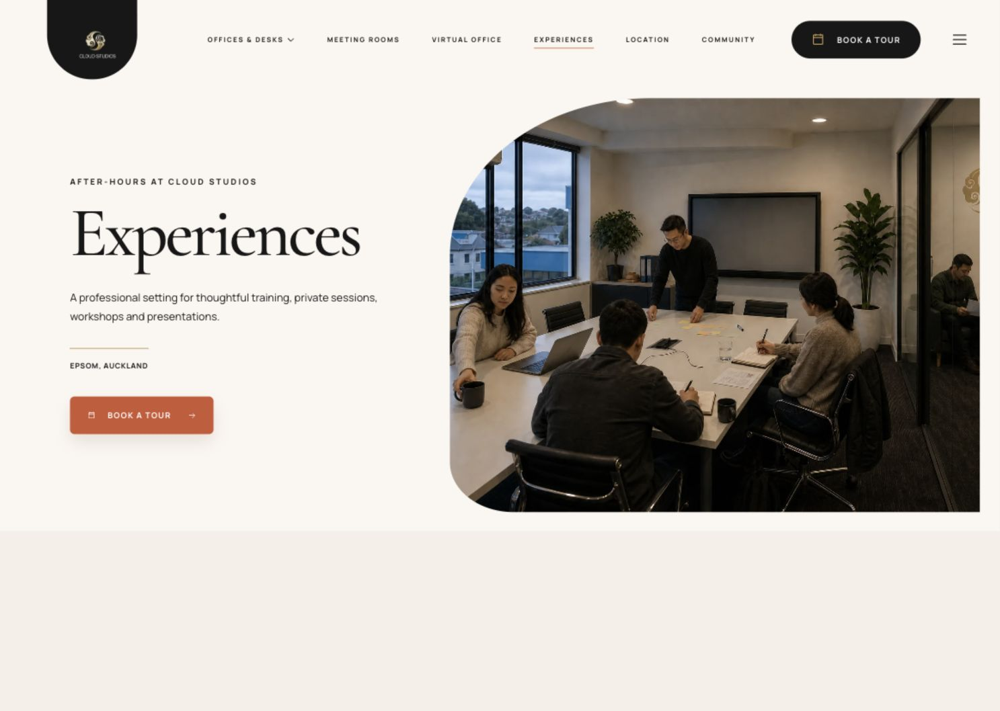

   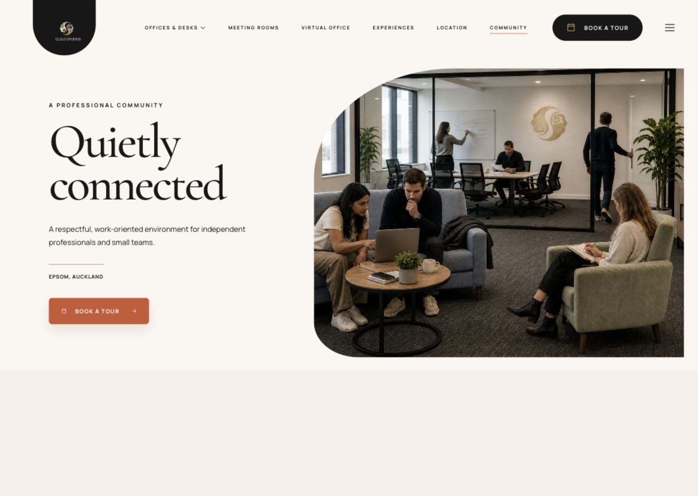

7. **Contact — good visual reassurance.** Phone, email and directions are available as alternatives. The form is pushed below a large editorial heading and its underline-only fields have low affordance. Business hours and expected reply time are absent.

   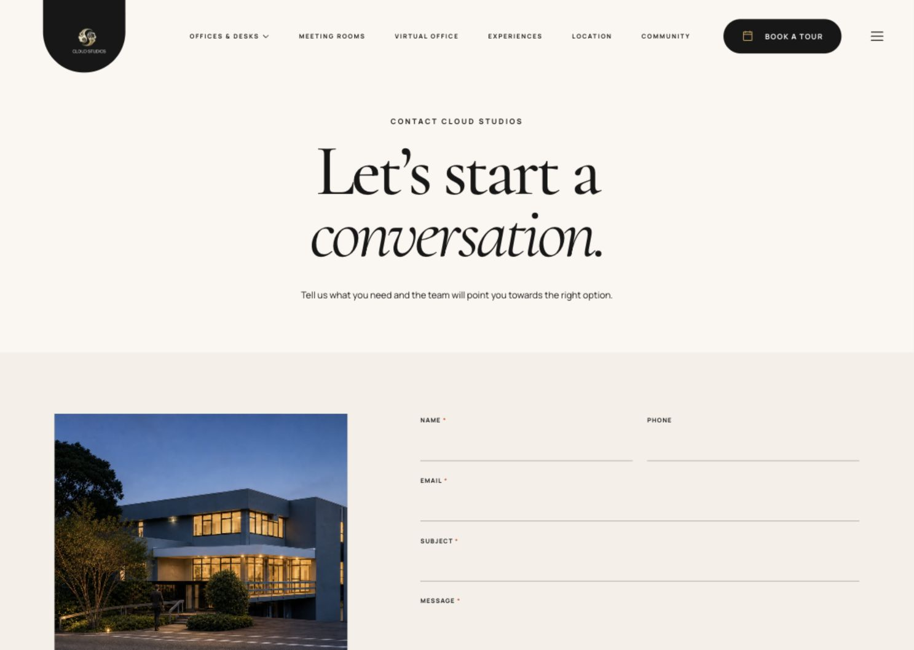

8. **Book a Tour — functional demo, accessibility risk.** Validation and demo success work without sending information. On mobile, the contact image/card comes before the form, placing the first field roughly 1,169 px below the top of the page. Invalid submission leaves focus on the submit button, provides no alert/live summary, and does not associate the service-interest error with the select.

   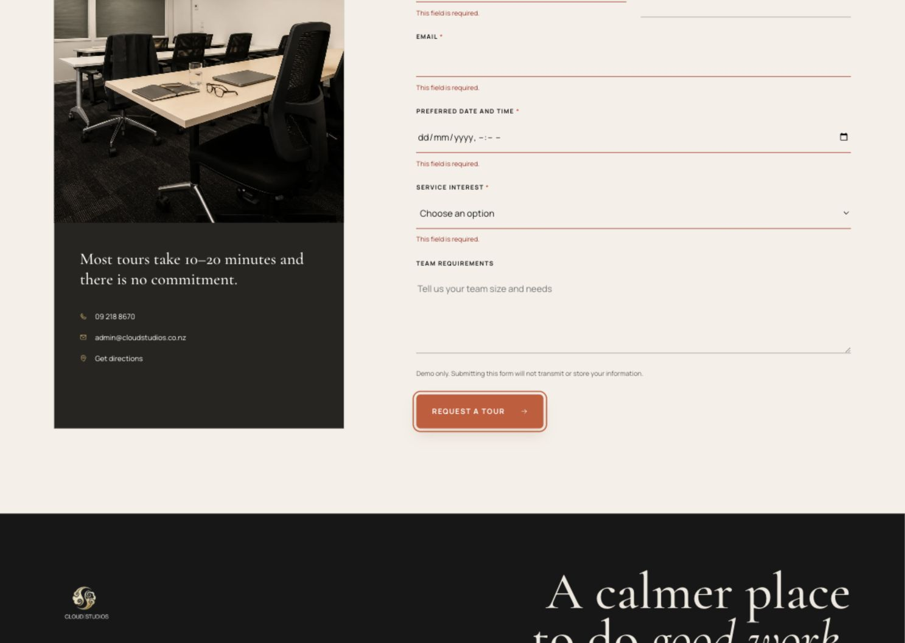

   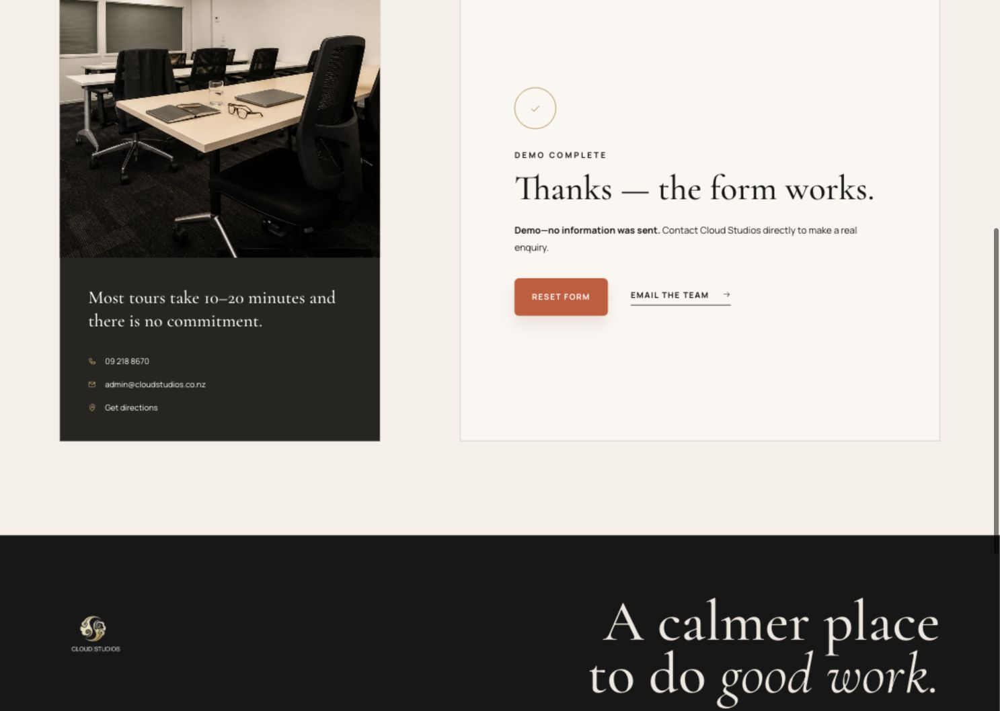

   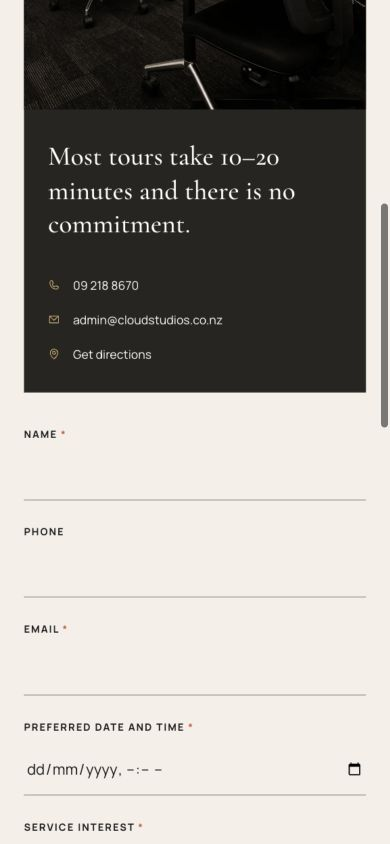

9. **FAQ — good.** Native `details`/`summary` controls are keyboard-focusable and the first answer is open by default. The content is useful but disconnected from the service pages and forms where those objections arise.

   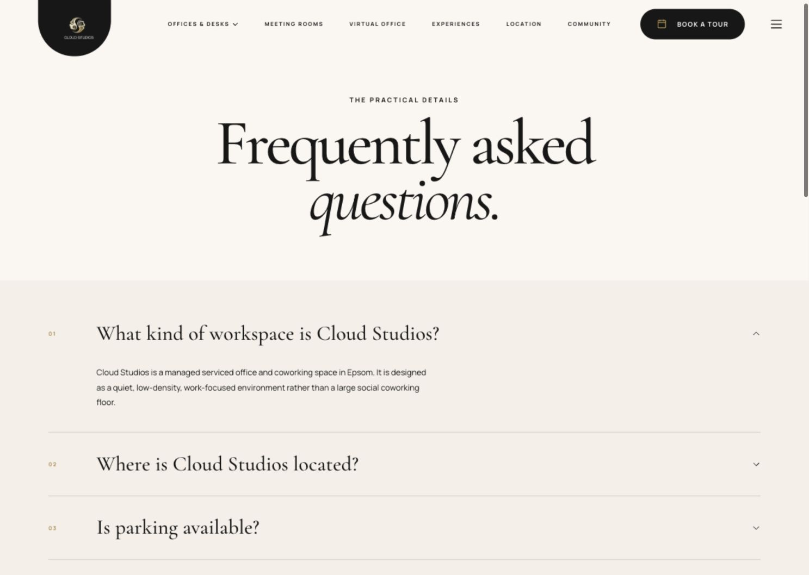

10. **Policies — visually consistent, not production-grade legal copy.** The pages are easy to scan, but the privacy policy has no effective date, named privacy contact/controller, concrete retention periods, cookies/analytics detail, or user-rights process. Legal review is still required before production.

    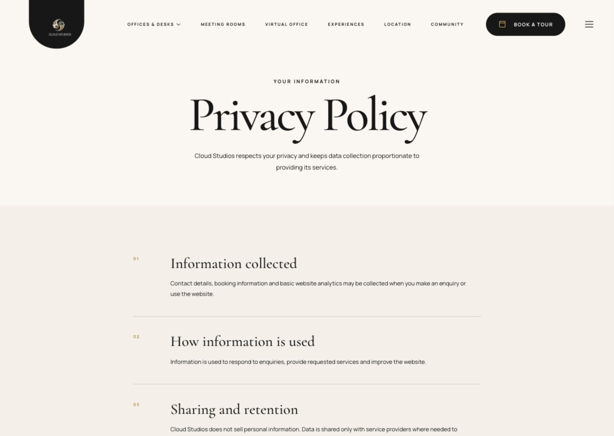

11. **Mobile navigation — critical defect.** The overlay lists all major commercial routes, phone and email. Once opened, however, the close control is visually covered, Escape does not dismiss it, body scrolling remains enabled, and the underlying page remains exposed in the accessibility tree.

    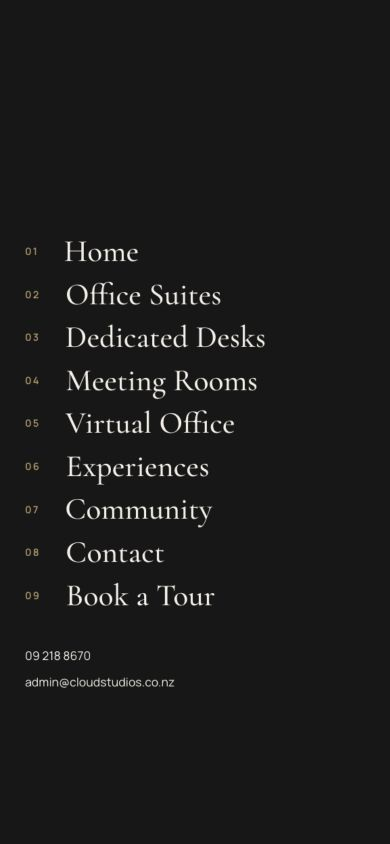

## Prioritised findings

### P0 — fix before further visual polish

1. **Mobile menu has no visible escape route.** The overlay covers the close button. Escape leaves `aria-expanded="true"`; background scrolling remains enabled; main-page controls remain exposed. This blocks normal dismissal and creates a keyboard/screen-reader failure.

### P1 — high-impact conversion and production gaps

2. **Use service-specific primary actions.** Keep “Book a tour” for offices and desks. Use “Check room availability” or “Enquire about this room” for Meeting Rooms, “Ask about virtual office” for Virtual Office, and “Discuss an event” for Experiences. Preserve phone/email alternatives.

3. **Make form errors perceivable and recoverable.** Add native `required` where appropriate, associate every error with its control, announce an error summary, and move focus to the summary or first invalid field. The current invalid submission leaves focus on the submit button, has no live error region, and the interest error has neither an ID nor `aria-describedby`.

4. **Add decision-critical service facts near the top.** Show the specific inclusions, capacities, terms, access, equipment, availability status and enquiry process that differ by service. The shared template currently makes materially different offerings feel interchangeable.

5. **Verify photography before production.** Several scenes look highly styled or composited. This audit cannot verify that they depict the actual premises. Use verified on-site photography, preserve truthful window views and room geometry, and avoid generated people or facilities that could be read as factual evidence.

6. **Reduce the initial JavaScript bundle.** The production bundle is 945.05 kB minified / 274.32 kB gzip and triggers Vite’s 500 kB warning. Three.js and GSAP are imported into the shared entry, so every route pays for homepage interaction code. Lazy-load the Three.js hero on the homepage and split page-level code before adding more interaction.

7. **Have policies reviewed and completed.** Add an effective date, controller/business identity, privacy contact, retention and deletion rules, cookie/analytics disclosure, rights process, booking/cancellation terms and applicable governing terms. This is a product risk, not merely a copy-edit.

### P2 — growth and polish opportunities

8. **Shorten the path to action on mobile.** Move the tour form above or before the large contact card, or reduce the card to a compact reassurance block. The first field currently starts more than one mobile screen below the heading.

9. **Improve small-text contrast.** White text on terracotta measures 4.24:1, below WCAG AA for normal-size text; gold on cream measures 2.91:1. Darken the terracotta used behind 12 px button labels and use a darker gold/ink treatment for 9–10 px informational text.

10. **Expose Contact and FAQ earlier.** Contact and FAQ are available in the footer/menu but absent from desktop primary navigation. A compact Contact link and contextual FAQ links would reduce uncertainty for high-intent visitors.

11. **Reduce oversized empty transitions.** Service/editorial heroes reserve large vertical areas before the next section appears. Tighten desktop min-heights and mobile heading/contact spacing so more decision content enters the first two screens.

12. **Strengthen Community and Experiences with verified proof.** Add real event formats, schedules, capacities, community standards, member stories or quotes only when Cloud Studios can verify them. Do not invent social proof.

13. **Make availability trustworthy.** Add a visible “updated on” date and a waitlist/enquiry path. A table showing five offices as leased and one as POA can otherwise read as “nothing is available.”

14. **Write route-specific metadata.** Every non-home description currently follows the same formula. Use each route’s actual service, location and action while keeping claims source-grounded. Expand LocalBusiness data only with verified hours, imagery and service details.

15. **Lazy-load below-fold media.** The homepage renders many image-heavy sections and no content images specify `loading="lazy"` or `decoding="async"`. Keep the hero eager, defer the service grid, location and gallery images.

16. **Remove obsolete assets from the production package.** The public asset folder contains 29 unused files totalling about 3.7 MB. They do not affect current page rendering but increase the handoff package and make image provenance harder to manage.

## What is already working well

- All 13 planned routes render directly with one H1, a canonical URL, meta description and shared LocalBusiness data.
- No tested route had horizontal overflow, broken images, missing image alt attributes, duplicate IDs or browser console errors.
- Pricing is visible for offices, desks and meeting rooms, and business contact details are consistent.
- The homepage has a strong hierarchy and clear location/service discovery.
- The mobile homepage retains the visual identity and uses a non-WebGL collage fallback.
- Skip navigation, visible focus styling, semantic landmarks, native FAQ controls and reduced-motion CSS are present.
- Tour/contact forms remain demo-only and correctly state that no information was sent.
- `npm test`, `npm run build` and `npm run test:sites` all pass.

## Recommended order of work

1. Fix the mobile-menu overlay, focus/escape behavior and background isolation.
2. Repair form error semantics and move the mobile form closer to the heading.
3. Replace shared tour CTAs with service-specific conversion paths.
4. Add the missing decision modules to each service page using verified business facts.
5. Verify/replace production photography and complete legal content.
6. Split the bundle, lazy-load media and remove obsolete assets.
7. Finish route-specific SEO and add analytics events for service CTA, form start, validation error, submission, phone, email and map clicks.

## Evidence limits

- This was a local prototype audit, not a production analytics or CRM audit.
- No real form submission was attempted; the prototype intentionally prevents transmission.
- No screen-reader session, physical-device lab, network throttling or formal legal review was performed.
- Visual inspection cannot prove that generated/styled photography accurately represents the premises.
- Policy observations are product-readiness issues, not legal advice.
